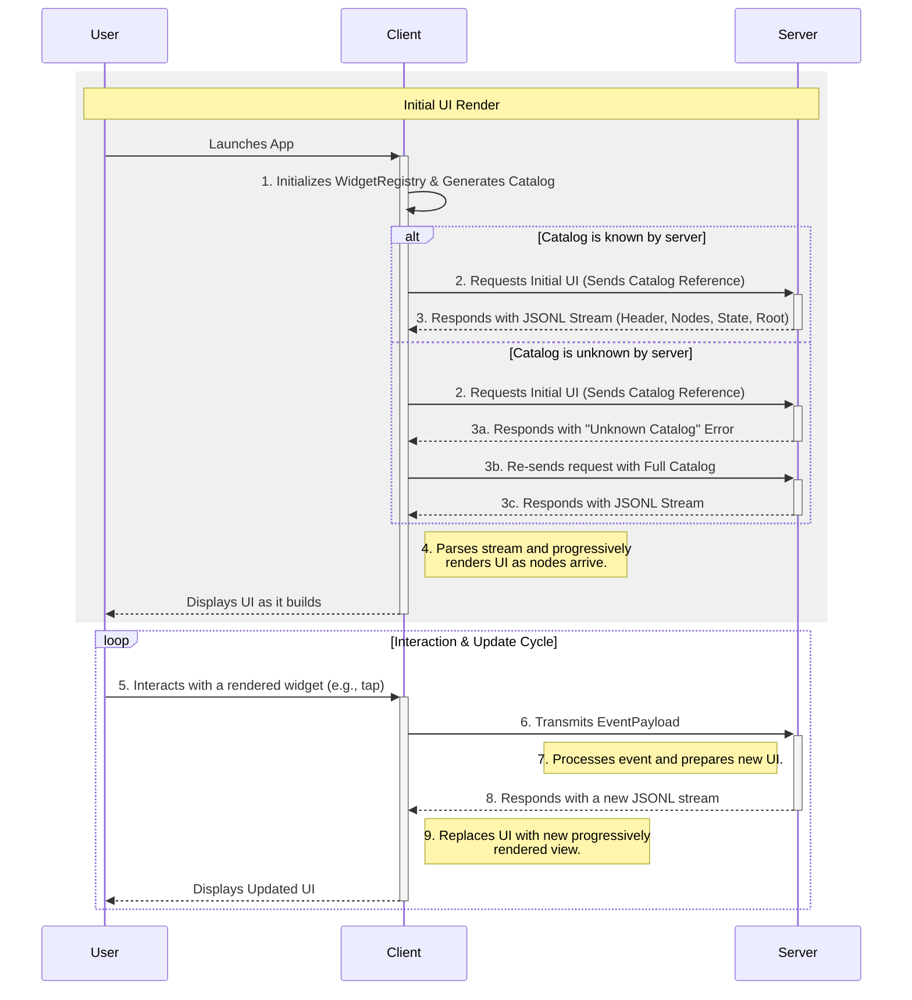

# **GenUI Streaming Protocol**

A Specification for a JSONL-Based, Streaming UI Framework

## **Section 1: Foundational Architecture and Data Flow**

This document specifies the architecture and data formats for the "GenUI Streaming Protocol" (GSP), a framework for rendering user interfaces from a stream of JSON objects. The design is guided by principles of strict separation of concerns, versioning, and progressive rendering, with schemas constrained for compatibility with structured data generation models.

### **1.1. Core Philosophy: Decoupling and Contracts**

The central philosophy of GUP is the strict decoupling of four key elements, which together define the complete user interface:

1. **The Catalog (The Contract):** A client-defined document that specifies precisely which widgets, properties, events, and data structures the application is capable of handling. This is a static contract that governs all communication.
2. **The Layout (The Structure):** A server-provided JSON structure that describes the arrangement of widgets, their static properties, and their relationships to one another.
3. **The State (The Data):** A server-provided JSON object containing the dynamic values that populate the layout, such as text content, boolean flags, or lists of data.
4. **The Data Model (The Schemas):** A set of formal definitions for complex data objects used within the state, included within the Catalog to ensure type safety.

### **1.2. The JSONL Stream: The Unit of Communication**

All UI descriptions are transmitted from the server to the client as a stream of JSON objects, formatted as JSON Lines (JSONL). Each line is a separate, compact JSON object representing a single message. This allows the client to parse and process each part of the UI definition as it arrives, enabling progressive rendering.

The stream consists of the following message types:

- `StreamHeader`: Contains metadata about the stream, such as the protocol version and the complete initial state. This is always the first message.
- `Layout`: Contains a batch of `LayoutNode` objects. This is the primary way layouts are transmitted.
- `LayoutRoot`: Specifies the ID of the root `LayoutNode`. The client can begin rendering once it receives this message and the corresponding `LayoutNode`.
- `StateUpdate`: Contains a partial update to the state object, used for changes after the initial render.

### **1.3. Data Flow Model**

The data flow is a well-defined sequence:

1. **Client Initialization:** The app initializes its widget registry and generates its `WidgetCatalog`.
2. **UI Request:** The client requests the UI from the server, sending its catalog reference.
3. **Server Response & Negotiation:** The server validates the catalog. If recognized, it begins sending the UI as a JSONL stream. If not, it sends an `UnknownCatalogError` and the client re-requests with the full catalog and no `catalogReference`.
4. **Client-Side Progressive Rendering:** The client parses the JSONL stream. As `LayoutNode` messages arrive, they are buffered. Once the `LayoutRoot` message is received, the client begins rendering the UI, progressively adding new elements as their corresponding nodes arrive.
5. **User Interaction:** A user interacts with a widget.
6. **Event Transmission:** The client sends an `EventPayload` to the server.
7. **Server-Side Logic & Streamed Update:** The server processes the event and responds with a new JSONL stream containing the updated UI.



## **Section 2: The Widget Catalog: Defining Capabilities and Data Models**

The `WidgetCatalog` is a JSON document that serves as a strict contract of the client's rendering and data-handling capabilities. While it can be a static file bundled with the application, it is typically generated at runtime from a `WidgetCatalogRegistry` where widget builders and their definitions are registered in code.

### **2.1. Purpose: The Client-Server Contract**

The catalog explicitly declares the client's capabilities, enabling:

- **Server-Side Validation:** The server can validate any `UiDefinitionPacket` against the client's catalog before sending it.
- **Versioning and Coexistence:** The server can support a set of known catalog versions, allowing it to generate compatible UI for different client versions without requiring the client to send its full capabilities on every request.
- **Guided LLM Generation:** The catalog provides a structured schema that can be used to constrain the output of a Large Language Model, ensuring it only generates valid, renderable UI definitions.
- **Formalized Data Structures:** It allows for defining complex data types, ensuring that `state` objects are well-formed and type-safe.

### **2.2. Catalog Schema (`WidgetCatalog`)**

The catalog is a top-level JSON object:

- `catalogVersion`: A string representing the version of the catalog file itself (e.g., "2.1.0").
- `dataTypes`: An object where each key is a custom data type name (e.g., `User`), and the value is a JSON Schema definition for that type.
- `items`: An object where each key is a widget type name (e.g., `Container`), and the value is a `WidgetDefinition` object.

### **2.3. Custom Data Type Definitions (`dataTypes`)**

This section allows the client to declare reusable, complex data structures. This is crucial for domain modeling and ensuring that state updates are type-safe.

The value of each key under `dataTypes` **must** be a valid JSON Schema object.

```json
// Example: A dataTypes block defining a nested TodoItem model
"dataTypes": {
  "TodoItem": {
    "type": "object",
    "properties": {
      "id": { "type": "string" },
      "details": {
        "type": "object",
        "properties": {
          "text": { "type": "string" },
          "priority": { "type": "string", "enum": ["low", "medium", "high"] }
        },
        "required": ["text"]
      },
      "isCompleted": { "type": "boolean", "default": false }
    },
    "required": ["id", "details"]
  }
}
```

### **2.4. Widget Definition Schema (`WidgetDefinition`)**

This object describes a single renderable widget type. It uses the JSON Schema standard to define its properties.

- `properties`: A **JSON Schema object** that defines the supported attributes for the widget. This allows for rich validation, including types, patterns, required fields, and nested objects.
- `events`: An object defining the events this widget can emit. Each key is an event name (e.g., `onPressed`), and the value is a JSON Schema defining the structure of the `arguments` object for that event.

```json
// Example: A WidgetDefinition for a 'ListItem' widget
"ListItem": {
  "properties": {
    "type": "object",
    "properties": {
      "text": { "type": "string" },
      "isCompleted": { "type": "boolean", "default": false }
    },
    "required": ["text"]
  },
  "events": {
    "onToggled": {
      "type": "object",
      "properties": {
        "newState": { "type": "boolean" }
      }
    }
  }
}
```

## **Section 3: UI Composition: The Streaming Layout**

To meet the constraint of a non-recursive format and enable streaming, the GSP layout is defined by a stream of `LayoutNode` messages.

### **3.1. The Adjacency List Model**

The layout is composed of `LayoutNode` objects that arrive individually over the stream. Parent-child relationships are established through ID references. This model allows for the client to buffer nodes as they arrive and assemble the UI tree once the root is known, and to continue to build it out as more nodes are received.

If the server sends a container with ids that aren't yet defined, the client can skip rendering those children until they are defined.

### **3.2. Layout Node Schema (`LayoutNode`)**

A `LayoutNode` message is a JSON object with the following keys:

- `id`: A required, unique string that identifies this specific widget instance.
- `type`: A string that must match a widget type name in the `WidgetCatalog`.
- `properties`: An object containing the properties for this widget. A property's value can be a static literal (string, number, boolean, etc.) or a binding object.
- `itemTemplate`: For list-building widgets, this is a complete `LayoutNode` object used as a template. See Section 3.3.

A property is considered a dynamic binding if its value is a JSON object containing a `"$bind"` key. The value of `"$bind"` is the path to the data in the state object. Any other keys in the object are transformations.

### **3.4. Advanced Composition: List Rendering with Builders**

To efficiently render dynamic lists (e.g., search results), the framework supports a builder pattern. This avoids defining a `LayoutNode` for every single item in a list.

A special widget type, e.g., `ListViewBuilder`, can be defined in the catalog. It uses a combination of data binding and a template to generate its children.

- **`properties`**: The builder widget itself has properties. Static ones have literal values, while dynamic ones use a binding object.

- **`itemTemplate`**: It contains a single `LayoutNode` definition that serves as a template for each item. This template can use relative binding paths, which the client resolves for each element of the bound `data` list.

```json
// Example: A node for a ListViewBuilder using the $bind property syntax
{
  "id": "todo_list",
  "type": "ListViewBuilder",
  "properties": {
    "scrollDirection": "vertical",
    "data": { "$bind": "/todoItems" }
  },
  "itemTemplate": {
    "id": "todo_item_template",
    "type": "ListItem",
    "properties": {
      "text": { "$bind": "details/text" },
      "isCompleted": { "$bind": "isCompleted" }
    }
  }
}
```

## **Section 4: Dynamic Data: The State Management Schema**

GUP enforces a clean separation between the UI's structure (layout) and its dynamic data (state).

### **4.1. The `state` Object: A Centralized Data Store**

The `initialState` object in the `StreamHeader` message provides the initial, complete state for the UI. Subsequent changes are delivered by `StateUpdate` messages. This state object is the sole source of truth for all dynamic data. By defining the structure of its contents in the catalog's `dataTypes` section, the state object is not an arbitrary blob but a well-defined, validatable data model.

### **4.2. Data Binding with Transformations**

The `properties` map within a `LayoutNode` forges the connection between layout and state. A property is bound to state if its value is an object containing a `"$bind"` key.

```json
// General structure of a binding object
"properties": {
  "widgetProperty": {
    "$bind": "/path/to/data", // Path to data in the state object
    // Optional transformers below
    "format": "Value is: {}"
  }
}
```

**Supported Transformations:**

- **`format`**: A string with a `{}` placeholder, which will be replaced by the value from the bound path.

  - Example: `{"$bind": "text", "format": "Todo: {}"}` (Relative path)

- **`condition`**: Evaluates a boolean value from the bound path.

  - `ifValue`: The value to use if the path is `true`.

  - `elseValue`: The value to use if the path is `false`.

  - Example: `{"$bind": "isCompleted", "condition": {"ifValue": "Done!", "elseValue": "Pending"}}` (Relative path)

- **`map`**: Maps a value to another value.

  - `mapping`: An object where keys are possible state values and values are the desired output.

  - `fallback`: A value to use if the state value is not in the map.

  - Example: `{"$bind": "/appStatus", "map": {"mapping": {"active": "#FF00FF00", "inactive": "#FFFF0000"}, "fallback": "#FF888888"}}` (Absolute path)

This small, predefined set of transformers adds significant declarative power without the security risks of a full expression language.

## **Section 5: Event Handling**

### **5.1. Client-to-Server: The `EventPayload`**

When a user triggers an event, the client sends an `EventPayload` message to the server. To support a stateless server architecture, this message must identify the client's capabilities.

The `EventPayload` is structured as follows:

- `catalogReference`: An optional object identifying a predefined base catalog.
  - `name`: The name of the base catalog (e.g., "material").
  - `version`: The semantic version of the base catalog (e.g., "1.2.1").
- `catalog`: An optional, partial `WidgetCatalog` object. If `catalogReference` is provided, this contains any client-specific additions or overrides to the base catalog. If `catalogReference` is omitted, this should contain the full widget catalog.
- `sourceNodeId`: The `id` of the `LayoutNode` that generated the event.
- `eventName`: The name of the event (e.g., `onPressed`).
- `timestamp`: An ISO 8601 string representing when the event occurred.
- `arguments`: An optional object containing contextual data. The structure of this object **must** conform to the schema defined for this event in the resolved `WidgetCatalog`.

### **5.2. Server-to-Client: Streamed UI Update**

After processing an event, the server responds with a new JSONL stream. This stream contains the complete definition for the new UI, allowing the client to progressively render the updated view.

## **Section 6: Complete JSON Schema Definitions**

This section provides the formal, consolidated, and valid JSON Schema definitions for the GSP framework. Each message in the JSONL stream must be one of the types defined in `oneOf`.

### **6.1. GSP Stream Message Schema**

```json
{
  "$schema": "https://json-schema.org/draft/2020-12/schema",
  "$id": "https://example.com/GSP-stream-schema-v1.json",
  "title": "GSP Stream Message Schema",
  "description": "A schema for a single message in a GSP JSONL stream.",
  "type": "object",
  "$defs": {
    "StreamHeader": {
      "type": "object",
      "properties": {
        "messageType": { "const": "StreamHeader" },
        "formatVersion": {
          "type": "string",
          "pattern": "^\\d+\\.\\d+\\.\\d+$"
        },
        "initialState": { "type": "object" }
      },
      "required": ["messageType", "formatVersion"]
    },
    "BindingObject": {
      "type": "object",
      "properties": {
        "$bind": { "type": "string" },
        "format": { "type": "string" },
        "condition": {
          "type": "object",
          "properties": {
            "ifValue": {},
            "elseValue": {}
          }
        },
        "map": {
          "type": "object",
          "properties": {
            "mapping": { "type": "object" },
            "fallback": {}
          }
        }
      },
      "required": ["$bind"]
    },
    "LayoutNode": {
      "type": "object",
      "properties": {
        "id": { "type": "string" },
        "type": { "type": "string" },
        "properties": {
          "type": "object",
          "additionalProperties": {
            "anyOf": [
              { "type": "string" },
              { "type": "number" },
              { "type": "boolean" },
              { "type": "object" },
              { "type": "array" },
              { "$ref": "#/$defs/BindingObject" }
            ]
          }
        },
        "itemTemplate": { "$ref": "#/$defs/LayoutNode" }
      },
      "required": ["id", "type"]
    },
    "Layout": {
      "type": "object",
      "properties": {
        "messageType": { "const": "Layout" },
        "nodes": {
          "type": "array",
          "items": { "$ref": "#/$defs/LayoutNode" }
        }
      },
      "required": ["messageType", "nodes"]
    },
    "LayoutRoot": {
      "type": "object",
      "properties": {
        "messageType": { "const": "LayoutRoot" },
        "rootId": { "type": "string" }
      },
      "required": ["messageType", "rootId"]
    },
    "StateUpdate": {
      "type": "object",
      "properties": {
        "messageType": { "const": "StateUpdate" },
        "state": { "type": "object" }
      },
      "required": ["messageType", "state"]
    },
    "CatalogReference": {
      "type": "object",
      "properties": {
        "name": { "type": "string" },
        "version": { "type": "string", "pattern": "^\\d+\\.\\d+\\.\\d+$" }
      },
      "required": ["name", "version"]
    },
    "PartialWidgetCatalog": {
      "type": "object",
      "properties": {
        "dataTypes": {
          "type": "object",
          "description": "A map of custom data type names to their JSON Schema definitions.",
          "additionalProperties": { "type": "object" }
        },
        "items": {
          "type": "object",
          "additionalProperties": { "$ref": "#/$defs/WidgetDefinition" }
        }
      }
    },
    "EventPayload": {
      "type": "object",
      "properties": {
        "messageType": { "const": "EventPayload" },
        "catalogReference": { "$ref": "#/$defs/CatalogReference" },
        "catalog": { "$ref": "#/$defs/PartialWidgetCatalog" },
        "sourceNodeId": { "type": "string" },
        "eventName": { "type": "string" },
        "timestamp": { "type": "string", "format": "date-time" },
        "arguments": { "type": "object" }
      },
      "required": ["messageType", "sourceNodeId", "eventName", "timestamp"]
    },
    "UnknownCatalogError": {
      "type": "object",
      "properties": {
        "messageType": { "const": "UnknownCatalogError" },
        "error": { "const": "UnknownCatalog" },
        "message": { "type": "string" }
      },
      "required": ["messageType", "error", "message"]
    }
  },
  "oneOf": [
    { "$ref": "#/$defs/StreamHeader" },
    { "$ref": "#/$defs/Layout" },
    { "$ref": "#/$defs/LayoutRoot" },
    { "$ref": "#/$defs/StateUpdate" },
    { "$ref": "#/$defs/EventPayload" },
    { "$ref": "#/$defs/UnknownCatalogError" }
  ]
}
```

## **Section 7: Client-Side Implementation and Best Practices**

### **7.1. The GSP Interpreter**

A robust client-side interpreter for a streaming protocol should be composed of several key components:

- **JSONL Parser:** A parser capable of reading the stream and decoding each line as a separate JSON object.
- **Message Dispatcher:** A mechanism to identify the `messageType` of each incoming JSON object and dispatch it to the appropriate handler (e.g., `StreamHeader`, `Layout`, `LayoutRoot`).
- **Layout Node Buffer:** A temporary storage (e.g., a `Map<String, LayoutNode>`) for `LayoutNode` objects received in `Layout` messages.
- **Widget Tree Builder:** Constructs the widget tree. Once the `LayoutRoot` message arrives, the builder can start assembling the tree using the nodes in the buffer.
- **State Manager:** Holds the state object, initialized from the `StreamHeader`'s `initialState`, and applies subsequent `StateUpdate` messages.
- **Binding Processor:** Resolves bindings by inspecting the `properties` of a `LayoutNode`. If a property's value is an object with a `"$bind"` key, it's treated as a dynamic binding. Otherwise, it's a static value.

### **7.2. Progressive Rendering**

The primary advantage of the streaming approach is the ability to render the UI as it arrives:

1.  The client begins parsing the JSONL stream.
2.  As `LayoutNode` messages are received, they are stored in the buffer.
3.  When the `LayoutRoot` message arrives, the client can immediately start building the widget tree, starting from the specified root ID.
4.  If the root node is already in the buffer, it is rendered. If not, the client waits for it to arrive.
5.  As more `LayoutNode` messages arrive, the client can fill in the missing parts of the widget tree. The UI will appear to "build itself" on the screen.

### **7.3. Performance Considerations**

- **Efficient List Building:** Use the underlying UI framework's mechanisms for efficient list building (e.g., `ListView.builder` in Flutter) to ensure that list items are only built as they are scrolled into view.
- **`const` Widgets:** Use `const` widgets in the client-side mapping code wherever possible.

### **7.4. Error Handling**

- **Invalid Payloads:** Handle malformed JSON or messages that do not conform to the schema.
- **Catalog Violations:** If the server sends a layout that violates the `WidgetCatalog`, the client should log the error and display a fallback UI.
- **Broken Bindings:** If a binding path is invalid, the client should use a default value or display a visual error indicator.

## Appendix A: Delta Updates

For performance-critical applications where sending the entire UI definition on every interaction is too costly, GUP supports an optional delta update mechanism. This allows the server to send only the changes to the layout or state.

### **A.1. Server-to-Client: The `StateUpdate` Payload**

To change only dynamic data, the server can send a `StateUpdate` payload. This payload uses a simplified model that is easy for Large Language Models (LLMs) to generate and avoids the complexity of index- or key-based list modifications.

The payload contains a single `operations` array, where each object is a specific command.

#### **A.1.1. The `stateSet` Operation**

This operation replaces the value at a given absolute path. If the path points to a list, the entire list is replaced. This is the primary mechanism for updating state.

- `op`: `"stateSet"`
- `path`: An absolute JSON Pointer-like path to a value in the state (e.g., `/todoItems`, `/user/name`).
- `value`: The new value to set at the specified path.

```json
{
  "op": "stateSet",
  "path": "/todoItems",
  "value": [
    { "id": "todo-123", "text": "Buy almond milk", "isCompleted": true },
    { "id": "todo-456", "text": "Call the bank", "isCompleted": false }
  ]
}
```

#### **A.1.2. The `listAppend` Operation**

This operation provides a convenient shortcut for appending one or more items to the end of a list without needing to send the entire list.

- `op`: `"listAppend"`
- `path`: An absolute path to the target list.
- `items`: An array of full item objects to add.

```json
{
  "op": "listAppend",
  "path": "/todoItems",
  "items": [
    { "id": "todo-789", "text": "Schedule appointment", "isCompleted": false }
  ]
}
```

### **A.2. Server-to-Client: The `LayoutUpdate` Payload**

For surgical modifications to the UI's structure, the server sends a `LayoutUpdate` payload with a simpler, custom operation set.

- `operations`: An array of layout modification objects. Each object specifies an `op` (`add`, `remove`, `replace`), the nodes to modify, and targeting information.

### **A.3. Delta Update Schemas**

```json
{
  "$schema": "https://json-schema.org/draft/2020-12/schema",
  "$id": "https://example.com/GUP-delta-payloads-schema-v2.json",
  "title": "GUP Delta Update Payloads Schema",
  "description": "A collection of schemas for delta updates in the GUP framework.",
  "type": "object",
  "$defs": {
    "StateUpdate": {
      "type": "object",
      "properties": {
        "operations": {
          "type": "array",
          "description": "A series of operations to apply to the state.",
          "items": {
            "oneOf": [
              {
                "type": "object",
                "title": "State Set Operation",
                "properties": {
                  "op": { "const": "stateSet" },
                  "path": { "type": "string" },
                  "value": {}
                },
                "required": ["op", "path", "value"]
              },
              {
                "type": "object",
                "title": "List Append Operation",
                "properties": {
                  "op": { "const": "listAppend" },
                  "path": { "type": "string" },
                  "items": { "type": "array" }
                },
                "required": ["op", "path", "items"]
              }
            ]
          }
        }
      },
      "required": ["operations"]
    },
    "LayoutUpdate": {
      "type": "object",
      "properties": {
        "operations": {
          "type": "array",
          "items": {
            "type": "object",
            "properties": {
              "op": {
                "type": "string",
                "enum": ["add", "remove", "replace"]
              },
              "nodes": {
                "type": "array",
                "items": {
                  "$ref": "#/$defs/LayoutNode"
                }
              },
              "nodeIds": {
                "type": "array",
                "items": {
                  "type": "string"
                }
              },
              "targetNodeId": {
                "type": "string"
              },
              "targetProperty": {
                "type": "string"
              }
            },
            "required": ["op"]
          }
        }
      },
      "required": ["operations"]
    }
  }
}
```

### **A.4. Client-Side Implementation for Delta Updates**

When implementing client-side support for delta updates, the following components are necessary:

- **Update Applier:** A component that processes incoming `StateUpdate` and `LayoutUpdate` payloads, applying the specified operations to the client's internal representation of the state and layout.
- **Granular Rebuilds:** The client should be able to trigger a rebuild of only the specific widgets affected by a state change, rather than rebuilding the entire tree. This is a key performance benefit of the delta update mechanism.
